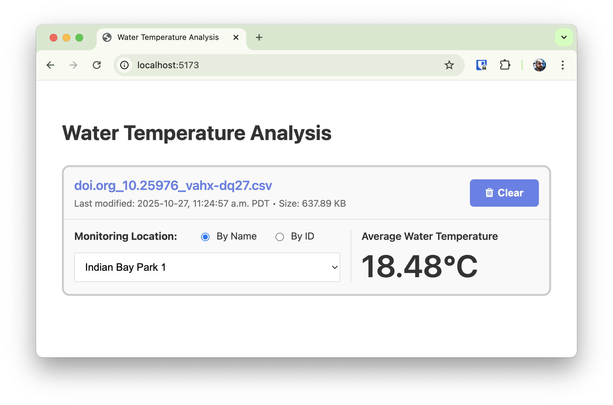

# Water Temperature Analysis - CSV Processing Application

A SvelteKit application for processing and analyzing water temperature data from CSV files.



You can see a [short movie](./watertempcomponent.mp4) here.

## Prerequisites

- [Node.js](https://nodejs.org/) (v22 or higher required)
- [Git](https://git-scm.com/)
- npm (comes with Node.js)
- (Optional) [nvm](https://github.com/nvm-sh/nvm) for Node version management

## Setup

### 1. Clone the repository

```bash
git clone <repository-url>
cd datastream-svelte-csv
```

### 2. Set up Node.js version

If using nvm, the correct Node.js version will be set automatically:

```bash
nvm use
```

Or manually install Node.js v22 if not using nvm.

### 3. Install dependencies

```bash
npm install
```

This will automatically:

- Install all Node.js dependencies
- Set up Husky git hooks (via the `prepare` script)
- Configure the pre-commit hook to run Prettier

### 4. Install Playwright browsers

Playwright requires browser binaries to be installed separately:

```bash
npx playwright install chromium
```

If you encounter system dependency issues on Linux, use:

```bash
npx playwright install chromium --with-deps
```

## Development

### Running the development server

```bash
npm run dev
```

The application will be available at `http://localhost:5173`

### Building for production

```bash
npm run build
```

Static files will be generated in the `build/` directory.

### Previewing the production build

```bash
npm run preview
```

Serves the production build locally at `http://localhost:4173`

## Code Quality

### Formatting

Format all files with Prettier:

```bash
npm run format
```

**Note:** Prettier runs automatically on staged files when you commit (via pre-commit hook).

### Type checking

```bash
npm run check
```

Run type checking in watch mode:

```bash
npm run check:watch
```

## Testing

### Run all tests

```bash
npm test
```

This runs both unit tests (Jest) and integration tests (Playwright) sequentially.

### Unit tests (Jest)

Run unit tests only:

```bash
npm run test:unit
```

Unit tests are located in `src/` with the pattern `*.test.ts`.

### Browser tests (Playwright)

Run browser tests only:

```bash
npm run test:browser
```

Integration tests are located in `tests/` with the pattern `*.spec.ts`.

**Note:** Integration tests require the application to be built first. The test script automatically builds and starts a preview server.

### CI testing

```bash
npm run test:ci
```

This is the same as `npm test` and is used in the GitHub Actions workflow.

## Git Hooks

This project uses [Husky](https://typicode.github.io/husky/) for git hooks:

- **pre-commit**: Runs `lint-staged` which formats staged files with Prettier

The hooks are automatically installed when you run `npm install`. If you need to reinstall them manually:

```bash
npx husky install
```

## Continuous Integration

This project uses GitHub Actions for continuous integration. The workflow is defined in `.github/workflows/ci.yml`.

### CI Workflow

The CI pipeline runs on:

- Push to `main` branch
- Pull requests to `main` branch

### CI Steps

1. **Checkout repository** - Clones the code
2. **Setup Node.js** - Installs Node.js v20 with npm caching
3. **Install dependencies** - Runs `npm ci` for clean dependency installation
4. **Install Playwright browsers** - Installs Chromium with system dependencies
5. **Run all tests** - Executes `npm run test:ci` (unit + integration tests)
6. **Upload Playwright report** - If tests fail, uploads the test report as an artifact

### Viewing CI Results

- Check the "Actions" tab in the GitHub repository
- Failed test runs will have downloadable Playwright reports as artifacts
- Artifacts are retained for 30 days

## Technologies

- **Framework**: [SvelteKit](https://kit.svelte.dev/)
- **Language**: [TypeScript](https://www.typescriptlang.org/)
- **Unit Testing**: [Jest](https://jestjs.io/)
- **Integration Testing**: [Playwright](https://playwright.dev/)
- **Code Formatting**: [Prettier](https://prettier.io/)
- **Git Hooks**: [Husky](https://typicode.github.io/husky/)
- **CSV Parsing**: [csv-parse](https://csv.js.org/parse/)

## Troubleshooting

### Pre-commit hook not running

If the pre-commit hook isn't working:

```bash
npx husky install
```

### Playwright tests failing

Ensure Playwright browsers are installed:

```bash
npx playwright install chromium
```

### Type errors after pulling changes

Regenerate SvelteKit types:

```bash
npx svelte-kit sync
```
